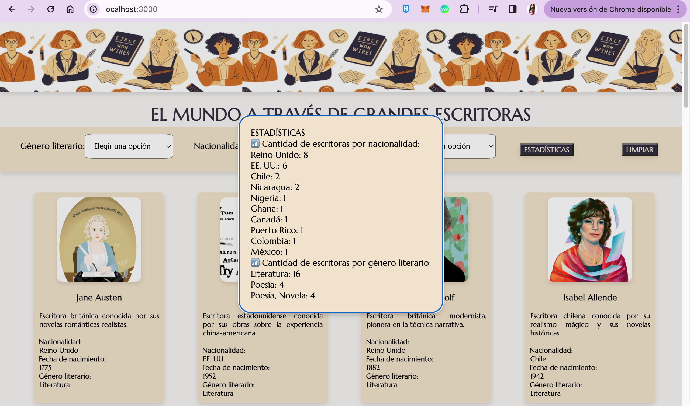

# Dataverse

## Índice

* [1. Preámbulo](#1-preámbulo)
* [2. Resumen del proyecto](#2-resumen-del-proyecto)
* [3. Consideraciones generales](#3-consideraciones-generales)
* [4. Funcionalidades](#4-funcionalidades)
* [5. Consideraciones técnicas](#5-consideraciones-técnicas)
* [6. Cumplimiento de criterios de aceptación mínimos del proyecto](#6-criterios-de-aceptación-mínimos-del-proyecto)
* [7. Objetivos de aprendizaje](#8-objetivos-de-aprendizaje)
* [8. Consideraciones para pedir tu Project Feedback](#10-consideraciones-para-pedir-tu-project-feedback)

***

## 1. Preámbulo

Según [Forbes](https://www.forbes.com/sites/bernardmarr/2018/05/21/how-much-data-do-we-create-every-day-the-mind-blowing-stats-everyone-should-read),
el 90% de la data que existe hoy ha sido creada durante los últimos dos años.
Cada día generamos 2.5 millones de terabytes de datos, una cifra sin
precedentes.

No obstante, los datos por sí mismos son de poca utilidad. Para que esas
grandes cantidades de datos se conviertan en **información** fácil de leer para
las usuarias, necesitamos entender y procesar estos datos. Una manera simple de
hacerlo es creando _interfaces_ y _visualizaciones_.

## 2. Resumen del proyecto

En este proyecto se presenta una página web para visualizar un conjunto (set) de datos generado con prompting a través de CHATGPT sobre escritoras en el mundo.
Las imágenes utilizadas en este proyecto fueron creadas por la inteligencia artificial de CANVA ("https://www.canva.com/design/DAF5m8QT6AQ/YcmdwNC1ccb9Edu-GefCRg/edit").

El diseño de esta página se realiza respóndiendo a tres historias de usuarias y a sus correspondientes pruebas de usabilidad.


## 3. Consideraciones generales

* Este proyecto fue desarrollado por la dupla conformada por Raiza Gatica y Elizabeth Patiño.
* Se desarrolló en cinco sprints.
* El proyecto se entrega mediante GitHub, en donde se desplegó la
  interfaz usando [GitHub Pages](https://pages.github.com/).

## 4. Funcionalidades

Esta página web que permite visualizar la data, filtrarla, ordenarla y calcular estadísticas sobre el género literario y la nacionalidad de las escritoras.

Adicionalmente, la página web permite que:

* La usuaria pueda ver los items de la data en una visualización tipo tarjeta. Las tarjetas están contenidas en un  elemento tipo `<li>` y estos a su vez están contenidas en
un elemento `<ul>`.**

* El elemento `<ul>` es hijo de un elemento con atributo _id_
  de valor "root". 

* Las tarjetas resaltan los valores de las propiedades de la data que
  le interesa ver a la usuaria como la imágen de la escritora, una descripción corta, nacionalidad, año de nacimiento y género literario.

* La interfaz estructura semánticamente la data usando el estándar [microdatos](https://developer.mozilla.org/en-US/docs/Web/HTML/Microdata).
  Se usan los atributos [`itemscope`](https://developer.mozilla.org/en-US/docs/Web/HTML/Global_attributes/itemscope),  [`itemtype`](https://developer.mozilla.org/en-US/docs/Web/HTML/Global_attributes/itemtype)
  y el atributo [`itemprop`](https://developer.mozilla.org/en-US/docs/Web/HTML/Global_attributes/itemprop).

  * La aplicación cálcula dos estadísticas. Una sobre el género literario  y otra sobre su nacionalidad de las escritoras que se describen en la página.
  
* Las funcionalidades de ordenar operan sobre la data filtrada por género literario y nacionalidad.
  
* La aplicación tiene un botón de limpiar que permite reiniciar los filtros y rendereizar la data original.

* La aplicación es responsive, es decir, que se visualiza sin problemas
  desde distintos tamaños de pantallas: móviles, tablets y desktops.

## 5. Consideraciones técnicas

La lógica del proyecto está implementada completamente en JavaScript
(ES6), HTML y CSS. Adicionalmente, se trabajó para realizar los test unitarios en Jest.

El _boilerplate_ contiene la siguiente estructura de archivos:
```text
.
├── README.md
├── package.json
├── src
|  ├── data 
|  |  └── dataset.js (La que hayas generado con la IA)
|  ├── dataFunctions.js
|  ├── view.js
|  ├── index.html
|  ├── main.js
|  └── style.css
└── test
   └── data.js
   └── dataFunctions.spec.js
   └── tests-read-only

```

## 6. cumplimiento de los criterios de aceptación mínimos del proyecto

### Criterios de código

Al ejecutar las pruebas se puede evidenciar el cumplimiento de los objetivos de aprendizaje. Esto se puede verificar usando los siguientes comandos. 

``` sh
npm run test:oas-html
npm run test:oas-css
npm run test:oas-web-api
npm run test:oas-js
npm run test:oas-prompting
npm run test:oas // Esto es para correr todos los tests de OAs
```
#### Definición del producto

La página webb se basó en las siguientes historias de usuarias.

#### Historias de usuaria

Historia 1: Elena, una adolescente interesada por la lectura quiere ver diferentes opciones de escritoras para elegir un libro. 

Historia 2: Claudia, como usuaria interesada en la literatura quiere poder filtrar y encontrar escritoras mujeres según el género literario en el que se especializan. Esto le permitirá descubrir nuevas autoras que se centren en sus géneros literarios favoritos y explorar su trabajo.  

Historia 3: Clara como investigadora literaria, necesita acceder a información detallada sobre la vida y obra de escritoras mujeres a nivel mundial. Quiere poder filtrar resultados por detalles biográficos como nacionalidad para obtener una comprensión más completa de su contexto.

Historia 4: Sofía, después de ver las nacionalidades de las escritoras quiere identificar cuántas pertenecen a cada país para compartir dicha información con sus estudiantes.

A partir de estas historias de usuarias se planificaron  los sprint y el desarrollo de las funcionalidades de la página web. Por ejemplo, en el primer sprint se generó la data con ayuda de inteligencia artificial y se mostró esta información en la página web a partir de una función de renderización desde js. 

#### Prompt utilizado para generar la data

Uno de los prompt utilizados para generar la data fueron: 


#### Diseño de la Interfaz de Usuaria

##### Prototipo de alta fidelidad

El diseño de la interfaz se realizó en figma. Se realizaron prototipos de baja, media y alta fidelidad. 
Para mejorar el diseño pedimos feedback a las compañeraas y a las coaches. El siguiente fue el resultado.

Prototipo de baja fidelidad


Prototipo de alta fidelidad


Estadísticas




Prototipo responsive


#### Testeos de usabilidad

Los test de usabilidad sirvieron para identificar los filtros que aplicaríamos a la data. 

#### Pruebas unitarias

En este proyecto se diseñaron Pruebas Unitarias (_tests_), para las funciones de filtrar la data, ordenar la data, y para las estadísticas.


## 7. Objetivos de aprendizaje

Reflexiona y luego marca los objetivos que has llegado a entender y aplicar en tu proyecto. Piensa en eso al decidir tu estrategia de trabajo.

### HTML

- [x] **Uso de HTML semántico**

  <details><summary>Links</summary><p>

  * [HTML semántico](https://curriculum.laboratoria.la/es/topics/html/html5/semantic-html)
  * [Semantics - MDN Web Docs Glossary](https://developer.mozilla.org/en-US/docs/Glossary/Semantics#Semantics_in_HTML)
</p></details>

### CSS

- [x] **Uso de selectores de CSS**

  <details><summary>Links</summary><p>

  * [Intro a CSS](https://curriculum.laboratoria.la/es/topics/css/css/intro-css)
  * [CSS Selectors - MDN](https://developer.mozilla.org/es/docs/Web/CSS/CSS_Selectors)
</p></details>

- [x] **Modelo de caja (box model): borde, margen, padding**

  <details><summary>Links</summary><p>

  * [Box Model & Display](https://curriculum.laboratoria.la/es/topics/css/css/boxmodel-and-display)
  * [The box model - MDN](https://developer.mozilla.org/en-US/docs/Learn/CSS/Building_blocks/The_box_model)
  * [Introduction to the CSS box model - MDN](https://developer.mozilla.org/en-US/docs/Web/CSS/CSS_Box_Model/Introduction_to_the_CSS_box_model)
  * [CSS display - MDN](https://developer.mozilla.org/pt-BR/docs/Web/CSS/display)
  * [display - CSS Tricks](https://css-tricks.com/almanac/properties/d/display/)
</p></details>

- [x] **Uso de flexbox en CSS**

  <details><summary>Links</summary><p>

  * [A Complete Guide to Flexbox - CSS Tricks](https://css-tricks.com/snippets/css/a-guide-to-flexbox/)
  * [Flexbox Froggy](https://flexboxfroggy.com/#es)
  * [Flexbox - MDN](https://developer.mozilla.org/en-US/docs/Learn/CSS/CSS_layout/Flexbox)
</p></details>

### Web APIs

- [x] **Uso de selectores del DOM**

  <details><summary>Links</summary><p>

  * [Manipulación del DOM](https://curriculum.laboratoria.la/es/topics/browser/dom/1-dom-methods-selection)
  * [Introducción al DOM - MDN](https://developer.mozilla.org/es/docs/Web/API/Document_Object_Model/Introduction)
  * [Localizando elementos DOM usando selectores - MDN](https://developer.mozilla.org/es/docs/Web/API/Document_object_model/Locating_DOM_elements_using_selectors)
</p></details>

- [x] **Manejo de eventos del DOM (listeners, propagación, delegación)**

  <details><summary>Links</summary><p>

  * [Introducción a eventos - MDN](https://developer.mozilla.org/es/docs/Learn/JavaScript/Building_blocks/Events)
  * [EventTarget.addEventListener() - MDN](https://developer.mozilla.org/es/docs/Web/API/EventTarget/addEventListener)
  * [EventTarget.removeEventListener() - MDN](https://developer.mozilla.org/es/docs/Web/API/EventTarget/removeEventListener)
  * [El objeto Event](https://developer.mozilla.org/es/docs/Web/API/Event)
</p></details>

- [x] **Manipulación dinámica del DOM**

  <details><summary>Links</summary><p>

  * [Introducción al DOM](https://developer.mozilla.org/es/docs/Web/API/Document_Object_Model/Introduction)
  * [Node.appendChild() - MDN](https://developer.mozilla.org/es/docs/Web/API/Node/appendChild)
  * [Document.createElement() - MDN](https://developer.mozilla.org/es/docs/Web/API/Document/createElement)
  * [Document.createTextNode()](https://developer.mozilla.org/es/docs/Web/API/Document/createTextNode)
  * [Element.innerHTML - MDN](https://developer.mozilla.org/es/docs/Web/API/Element/innerHTML)
  * [Node.textContent - MDN](https://developer.mozilla.org/es/docs/Web/API/Node/textContent)
</p></details>

### JavaScript

- [x] **Diferenciar entre tipos de datos primitivos y no primitivos**

- [x] **Arrays (arreglos)**

  <details><summary>Links</summary><p>

  * [Arreglos](https://curriculum.laboratoria.la/es/topics/javascript/arrays)
  * [Array - MDN](https://developer.mozilla.org/es/docs/Web/JavaScript/Reference/Global_Objects/Array/)
  * [Array.prototype.sort() - MDN](https://developer.mozilla.org/es/docs/Web/JavaScript/Reference/Global_Objects/Array/sort)
  * [Array.prototype.forEach() - MDN](https://developer.mozilla.org/es/docs/Web/JavaScript/Reference/Global_Objects/Array/forEach)
  * [Array.prototype.map() - MDN](https://developer.mozilla.org/es/docs/Web/JavaScript/Reference/Global_Objects/Array/map)
  * [Array.prototype.filter() - MDN](https://developer.mozilla.org/es/docs/Web/JavaScript/Reference/Global_Objects/Array/filter)
  * [Array.prototype.reduce() - MDN](https://developer.mozilla.org/es/docs/Web/JavaScript/Reference/Global_Objects/Array/Reduce)
</p></details>

- [x] **Objetos (key, value)**

  <details><summary>Links</summary><p>

  * [Objetos en JavaScript](https://curriculum.laboratoria.la/es/topics/javascript/objects/objects)
</p></details>

- [ ] **Variables (declaración, asignación, ámbito)**

  <details><summary>Links</summary><p>

  * [Valores, tipos de datos y operadores](https://curriculum.laboratoria.la/es/topics/javascript/basics/values-variables-and-types)
  * [Variables](https://curriculum.laboratoria.la/es/topics/javascript/basics/variables)
</p></details>

- [x] **Uso de condicionales (if-else, switch, operador ternario, lógica booleana)**

  <details><summary>Links</summary><p>

  * [Estructuras condicionales y repetitivas](https://curriculum.laboratoria.la/es/topics/javascript/flow-control/conditionals-and-loops)
  * [Tomando decisiones en tu código — condicionales - MDN](https://developer.mozilla.org/es/docs/Learn/JavaScript/Building_blocks/conditionals)
</p></details>

- [x] **Uso de bucles/ciclos (while, for, for..of)**

  <details><summary>Links</summary><p>

  * [Bucles (Loops)](https://curriculum.laboratoria.la/es/topics/javascript/flow-control/loops)
  * [Bucles e iteración - MDN](https://developer.mozilla.org/es/docs/Web/JavaScript/Guide/Loops_and_iteration)
</p></details>

- [x] **Funciones (params, args, return)**

  <details><summary>Links</summary><p>

  * [Funciones (control de flujo)](https://curriculum.laboratoria.la/es/topics/javascript/flow-control/functions)
  * [Funciones clásicas](https://curriculum.laboratoria.la/es/topics/javascript/functions/classic)
  * [Arrow Functions](https://curriculum.laboratoria.la/es/topics/javascript/functions/arrow)
  * [Funciones — bloques de código reutilizables - MDN](https://developer.mozilla.org/es/docs/Learn/JavaScript/Building_blocks/Functions)
</p></details>

- [x] **Pruebas unitarias (unit tests)**

  <details><summary>Links</summary><p>

  * [Empezando con Jest - Documentación oficial](https://jestjs.io/docs/es-ES/getting-started)
</p></details>

- [x] **Módulos de ECMAScript (ES Modules)**

  <details><summary>Links</summary><p>

  * [import - MDN](https://developer.mozilla.org/es/docs/Web/JavaScript/Reference/Statements/import)
  * [export - MDN](https://developer.mozilla.org/es/docs/Web/JavaScript/Reference/Statements/export)
</p></details>

- [x] **Uso de linter (ESLINT)**

- [x] **Uso de identificadores descriptivos (Nomenclatura y Semántica)**

- [x] **Diferenciar entre expresiones (expressions) y sentencias (statements)**

### Control de Versiones (Git y GitHub)

- [x] **Git: Instalación y configuración**

- [x] **Git: Control de versiones con git (init, clone, add, commit, status, push, pull, remote)**

- [x] **Git: Integración de cambios entre ramas (branch, checkout, fetch, merge, reset, rebase, tag)**

- [x] **GitHub: Creación de cuenta y repos, configuración de llaves SSH**

- [x] **GitHub: Despliegue con GitHub Pages**

  <details><summary>Links</summary><p>

  * [Sitio oficial de GitHub Pages](https://pages.github.com/)
</p></details>

- [x] **GitHub: Colaboración en Github (branches | forks | pull requests | code review | tags)**

### Centrado en el usuario

- [x] **Diseñar y desarrollar un producto o servicio poniendo a las usuarias en el centro**

### Diseño de producto

- [x] **Crear prototipos de alta fidelidad que incluyan interacciones**

- [x] **Seguir los principios básicos de diseño visual**

### Investigación

- [x] **Planear y ejecutar testeos de usabilidad de prototipos en distintos niveles de fidelidad**

  <details><summary>Links</summary><p>

  * [Intro a testeos usabilidad](https://coda.io/@bootcamp-laboratoria/contenido-ux/test-de-usabilidad-15)
  * [Pruebas con Usuarios 1 — ¿Qué, cuándo y para qué testeamos?](https://eugeniacasabona.medium.com/pruebas-con-usuarios-1-qu%C3%A9-cu%C3%A1ndo-y-para-qu%C3%A9-testeamos-7c3a89b4b5e7)
</p></details>

### AI Prompting

- [x] **Dando Instrucciones**

  <details><summary>Links</summary><p>

  * [Dando Instrucciones | Learn Prompting: Your Guide to Communicating with AI](https://learnprompting.org/es/docs/basics/instructions)
</p></details>

- [x] **Few shot prompting**

  <details><summary>Links</summary><p>

  * [Few shot prompting | Learn Prompting: Your Guide to Communicating with AI](https://learnprompting.org/es/docs/basics/few_shot)
</p></details>

### Contenido de referencia

#### Desarrollo Front-end

* [Tópicos en la currícula de Laboratoria](https://curriculum.laboratoria.la/es/web-dev/topics)
  testing, arreglos, objetos, funciones, DOM en Browser Javascript.
* [Buscando elementos con querySelector*](https://es.javascript.info/searching-elements-dom)
* [Objeto del evento](https://es.javascript.info/introduction-browser-events#objeto-del-evento)
* [Array en MDN](https://developer.mozilla.org/es/docs/Web/JavaScript/Referencia/Objetos_globales/Array)
* [Array.sort en MDN](https://developer.mozilla.org/es/docs/Web/JavaScript/Referencia/Objetos_globales/Array/sort)
* [Array.toSorted en MDN](https://developer.mozilla.org/en-US/docs/Web/JavaScript/Reference/Global_Objects/Array/toSorted)
* [Array.map en MDN](https://developer.mozilla.org/es/docs/Web/JavaScript/Referencia/Objetos_globales/Array/map)
* [Array.filter en MDN](https://developer.mozilla.org/es/docs/Web/JavaScript/Referencia/Objetos_globales/Array/filter)
* [Array.reduce en MDN](https://developer.mozilla.org/es/docs/Web/JavaScript/Referencia/Objetos_globales/Array/reduce)
* [Array.forEach en MDN](https://developer.mozilla.org/es/docs/Web/JavaScript/Referencia/Objetos_globales/Array/forEach)
* [Object.keys en MDN](https://developer.mozilla.org/es/docs/Web/JavaScript/Referencia/Objetos_globales/Object/keys)
* [Object.entries en MDN](https://developer.mozilla.org/es/docs/Web/JavaScript/Referencia/Objetos_globales/Object/entries)
* [Atributos de datos](https://developer.mozilla.org/es/docs/Learn/HTML/Howto/Use_data_attributes)
* [expressions-vs-statements](https://2ality.com/2012/09/expressions-vs-statements.html)
* [expresión vs sentencia](https://openclassrooms.com/en/courses/4309531-descubre-las-funciones-en-javascript/5108986-diferencia-entre-expresion-y-sentencia)
* [Datos atómicos vs datos estructurados](https://www.todojs.com/tipos-datos-javascript-es6/)
* [Módulos: Export](https://developer.mozilla.org/es/docs/Web/JavaScript/Referencia/Sentencias/export)
* [Módulos: Import](https://developer.mozilla.org/es/docs/Web/JavaScript/Referencia/Sentencias/import)
* [Diferencia entre array y objetos](https://youtu.be/mJJloQY7A8Y)
* [¿Cómo puedo recorrer un objeto?](https://youtube.com/01RHn23Bn_0)
* [`map`, `filter`, `sort` y `reduce` también son métodos para objetos](https://youtu.be/bUl1R2lQvKo)
* [Diferencia entre expression y statements](https://youtu.be/wlukoWco2zk)
* [Diferencia entre createElement e innerHTML](https://www.javascripttutorial.net/javascript-dom/javascript-innerhtml-vs-createelement/)
* [¿Qué es el Scope?](https://youtu.be/s-7C09ymzK8)

#### Herramientas

* [Git](https://git-scm.com/)
* [GitHub](https://github.com/)
* [GitHub Pages](https://pages.github.com/)
* [Para preguntas sobre Git recomendamos ver este playlist](https://www.youtube.com/watch?v=F1EoBbvhaqU&list=PLiAEe0-R7u8k9o3PbT3_QdyoBW_RX8rnV)
* [Node.js](https://nodejs.org/)
* [Jest](https://jestjs.io/)

#### Organización del Trabajo

* [Historias de Usuario](https://www.youtube.com/watch?v=ky6wFiF5vMk&t=344s).
  Ojo que Cris no diferencia _Definición de terminado_ de _Criterios de
  Aceptación_ y nosotros sí lo haremos. Más detalles en la guía.
* [Cómo dividir H.U.](https://www.youtube.com/watch?v=Ueq786iZ30I&t=341s)

## 8. Consideraciones para pedir tu Project Feedback

El proyecto cumple con las siguientes características:

* [x] Cumple con todos los criterios mínimos de aceptación al ejecutar `npm run test:oas`
* [x] Cumple con todas las pruebas _end to end_ al ejecutar `npm run test:e2e`
* [x] Cumple con todas las pruebas unitarias al ejecutar `npm run test` y
  que tienen una cobertura del 70% de _statements_ (_sentencias_),
  _functions_ (_funciones_), _lines_ (_líneas_), y _branches_
* [x] Esta libre de _errores_ de `eslint` al ejecutar `npm run pretest`
* [x] Está subido a GitHub y desplegado en GitHub Pages
* [x] Captura de pantalla del prompt utilizado para generar los datos.
* Tiene un `README.md` con la siguente:
  - [x] _Definición del producto_ clara e informativa
  - [x] Historias de usuario
  - [x] Un _Diseño de la Interfaz de Usuaria_ (prototipo de alta fidelidad)
  - [x] El listado de problemas que detectaste a través de tests
    de usabilidad en el `README.md`
* Tiene un UI que cumple las funcionalidades:
  - [x] Muestra lista con datos y/o indicadores
  - [x] Permite ordenar data por uno o más campos (asc y desc)
  - [x] Permite filtrar data con base en una condición
  - [x] Permite limpiar los filtros con un botón
  - [x] Es _responsive_

